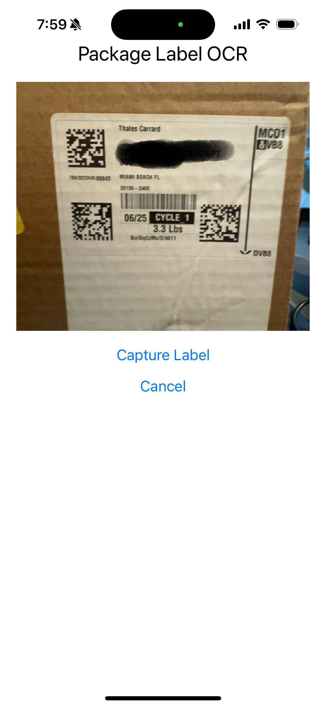
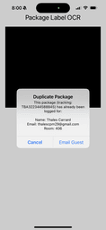
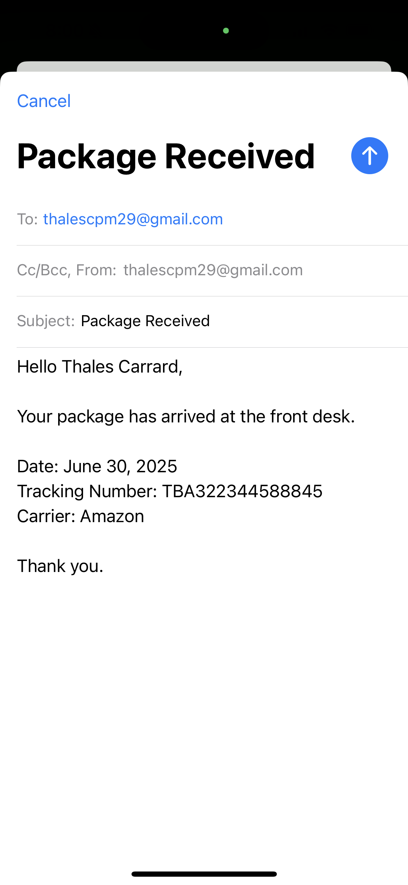

# 📦 Bellman App

A mobile app built with **React Native (Expo)** and **Firebase Functions** to scan package labels, extract guest info via OCR, check for duplicates, and notify the guest—designed for front desk and package management workflows.

## 🚀 Features

- 📷 Scan package labels using the device camera  
- 🔎 OCR processing via [OCR.Space](https://ocr.space/)  
- 🧠 Guest info extraction (name, email, room)  
- ✅ Duplicate detection  
- ✉️ Email notifications via Google Apps Script  
- 🔒 Secure API with Firebase Secrets & Cloud Run

##

## 🛠 Tech Stack

- **Frontend**: React Native (Expo)
- **Backend**: Firebase Cloud Functions (Gen 2, Express)
- **OCR**: OCR.Space API
- **Storage**: Google Sheets (via Apps Script)
- **CI/CD**: Firebase CLI
- **Security**: Firebase Secrets, Custom Service Account

##

## 📸 Usage

- Tap Scan Label
- OCR reads the label and extracts guest info
- App checks for duplicate packages
- Shows modal with guest & package info
- Tap to send notification or log delivery

##

